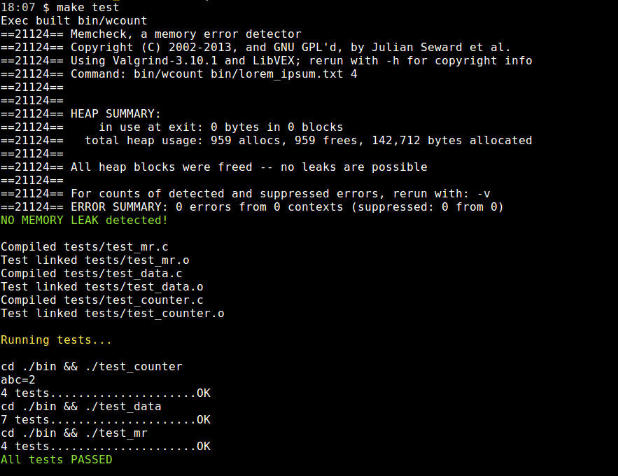
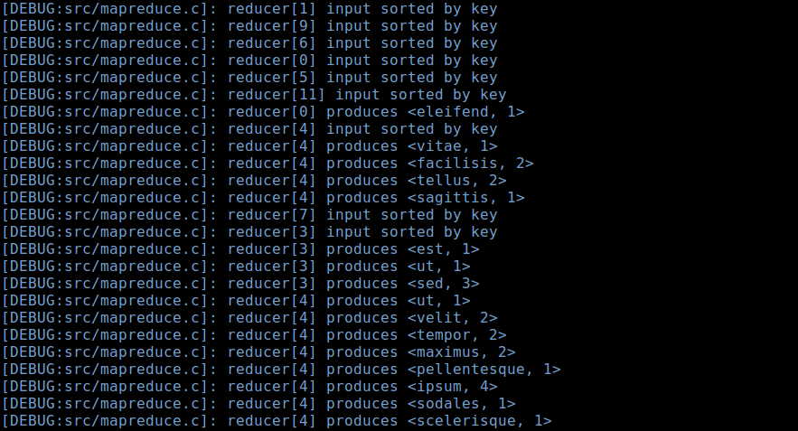

# Word Counter

Word Counter is a program that gives the number of occurences
of each word of a text file. The occurences are computed in parallel
using an implementation of **MapReduce** with threads.

## Usage

#### Build & Run

Install the following tools `make`, `gcc` and `Valgrind` for memory leak check
then:

```bash
cd word_counter/
make # the generated program is located at bin/wount
```

Program usage:
```
$ bin/wcount --help
Usage: counter <FILENAME> <NB_THREADS> [--help]
Count the number of occurences of each word in a given file.

Arguments
    FILENAME           the file to process.
    NB_THREADS         number of parallel threads.
    --help             print this help message
```

Run the program:

```bash
bin/wcount path/to/file.txt 7
```

Example output:


#### Test & Memory leak check

Run the unit tests and memory leak check with Valgrind,
using the following command:

```bash
make memcheck # run memory leak check only
make test # run all tests: unit tests and memory leak check
```

Output:



To view `debug messages` durring the program execution,
build the program in debug mode:

```bash
cd word_counter/
make clean debug # build in debug mode

bin/wcount path/to/file.txt 9 # run with debug messages
```

Example of debug messages:



## Implementation

MapReduce engine pseudo-code:

```js

// preparation
// - read lines and equally distribute them to the mappers
i = 0
while line = read_line()
    mapper[i].inputs += line
    i = (i + 1) % nb_threads

// map operation:
// - convert lines into pairs, ex line: "aa;bb" ==> pairs: {"aa", 1}, {"bb, 1"}
run parallel i in nb_threads
    for each line in mapper[i].inputs
        reducer[i].inputs += split(line)

// reduce operation:
// - sum the values of pairs that have the same key
// - ex: pairs: {"aa", 1}, {"aa, 1"} ==> pair: {"aa", 2}
run parallel i in nb_threads
    sort(reducer[i].inputs, by_key)
    for each pairs_with_same_key in reducer[i].inputs
        combiner[i].inputs += sum(pairs_with_same_key)

// - combine the reduced results into one result list
combined_pairs = chain(combiner[0...nb_threads].inputs)
sort(combined_pairs, by_key)
for each pairs_with_same_key in combined_pairs
    result += sum(pairs_with_same_key)

// print results
sort(result, by_value)
for each pair in result
    print(pair)

```

## Next steps

* Make the MapReduce engine even more scalable,
by storing intermediate results into temporary files instead of
keeping them into the system memory.

* Use `mmap` to manage the memory instead of list structures.

* Replace the `insert sort` used by the reducers by a faster sort algorithm,
like `Timsort`.

* Use a C test suite framework like `cUnit` for unit testing.
I might be even better to use a Python test framework like `pytest`
with `ctype` wrapping.

* Parse the program arguments with `getopt`.
